# axiom Architecture Diagrams

> Mermaid diagrams. Render with any Mermaid-compatible viewer.

---

## 1. Core Architecture

### 1.1 Three-Layer Structure

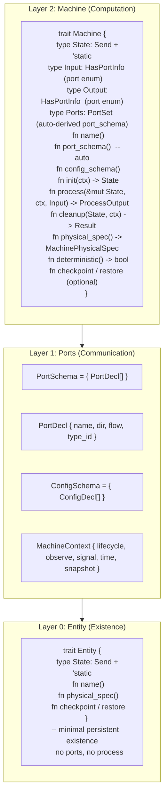

### 1.2 Port Three-Axis Design

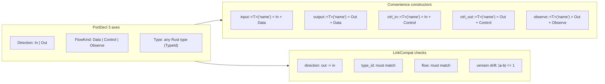

### 1.3 Two Computation Primitives

```mermaid
graph LR
  subgraph Func["Func (pure function)"]
    F1["Memory: Stack frame"]
    F2["State: None"]
    F3["Life: single call, unobservable"]
    F4["Connect: inline call only"]
    F5["Parallel: fully safe"]
    F6["Cost: zero (direct fn call)"]
    F7["Deterministic: guaranteed"]
    F8["Bridge: FuncMachine&lt;F&gt; -> Machine"]
  end

  subgraph Machine["Machine (state machine)"]
    M1["Memory: Heap"]
    M2["State: type State (persistent)"]
    M3["Life: init -> process* -> cleanup"]
    M4["Connect: ports (6 LinkKinds)"]
    M5["Parallel: &mut State per-instance serial"]
    M6["Cost: depends on LinkKind + runtime"]
    M7["Deterministic: opt-in declaration"]
    M8["Observe: FlowKind::Observe ports"]
  end

  Func -->|"FuncMachine embeds"| Machine
```

### 1.4 Six Link Strategies

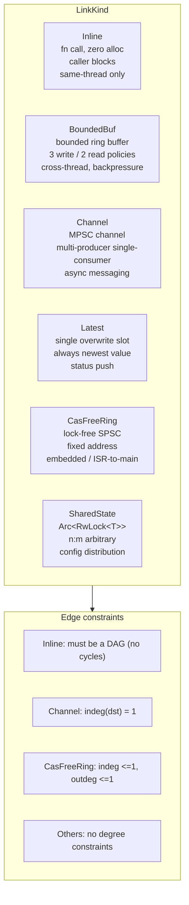

### 1.5 Deployment System

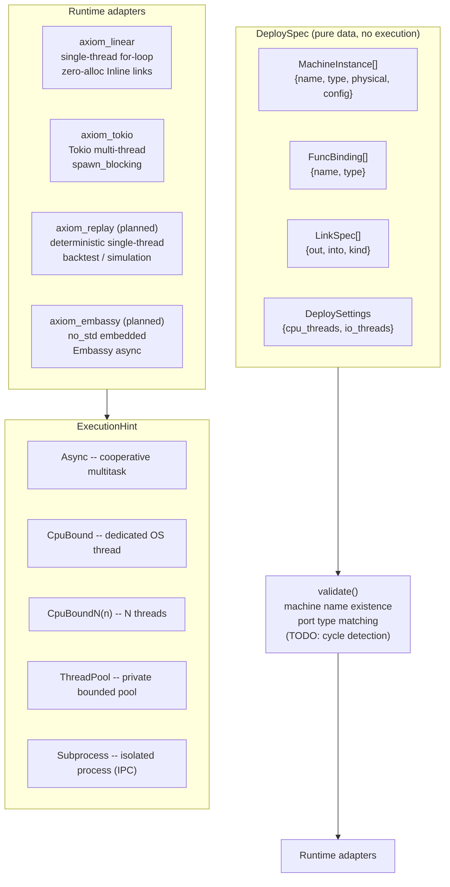

### 1.6 Algebraic Structure

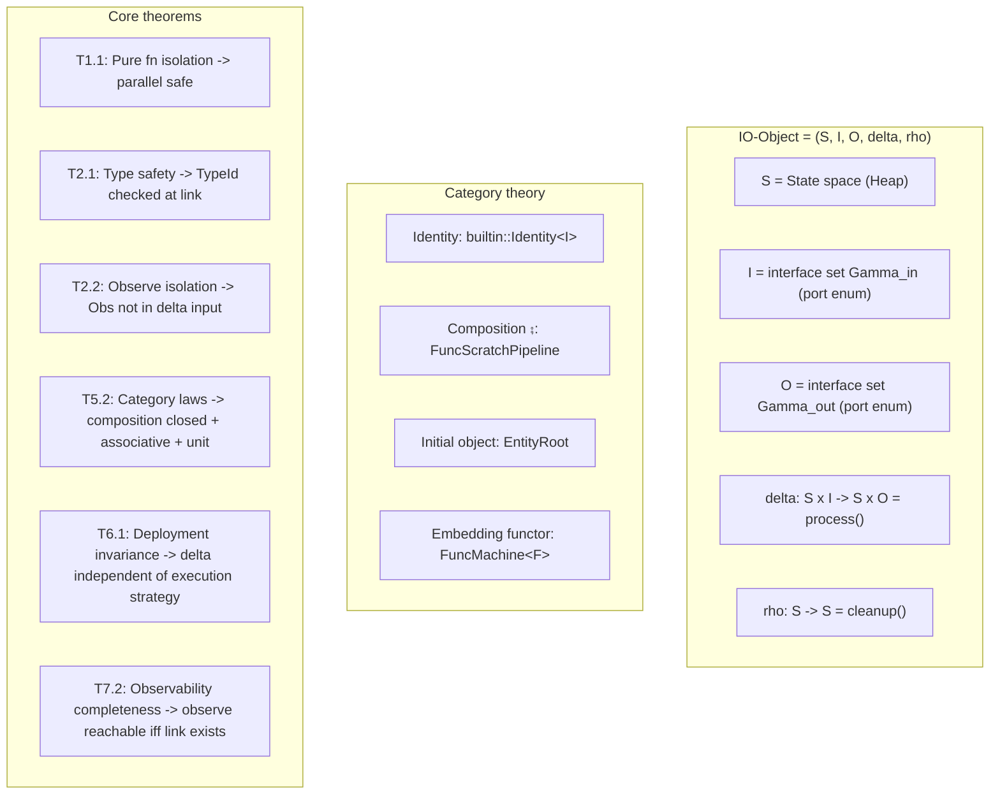

---

## 2. Complex Application: Smart Building Energy Management

### 2.1 System Topology

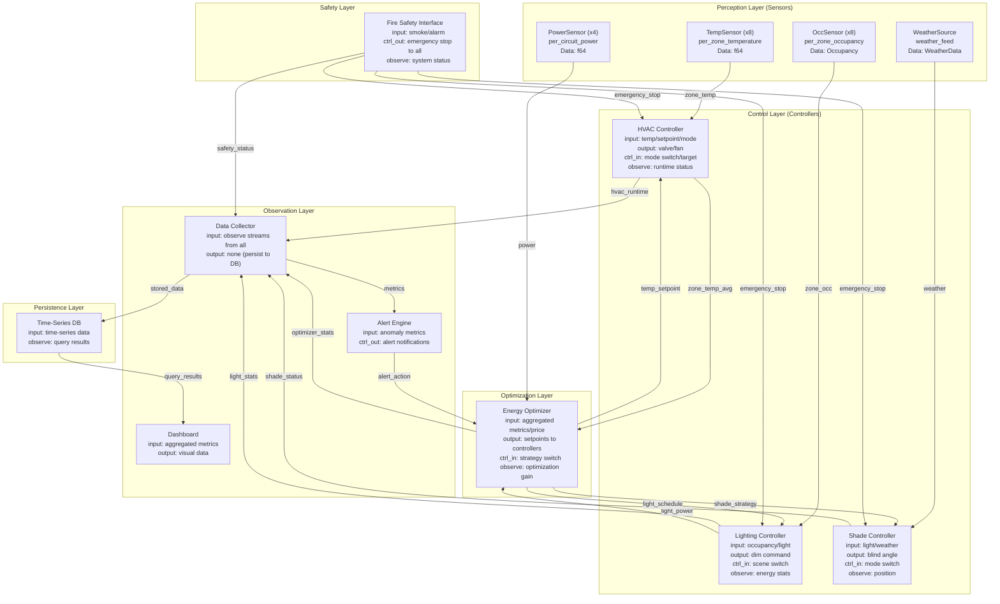

### 2.2 Port Declaration Examples

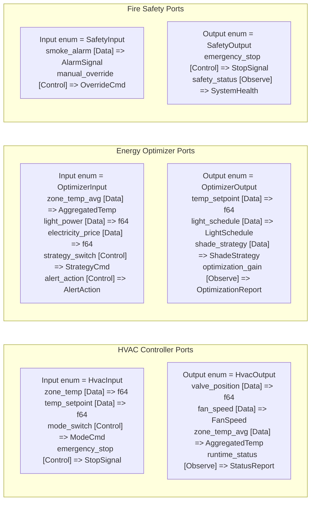

### 2.3 Deployment Topology (Multi-threaded)

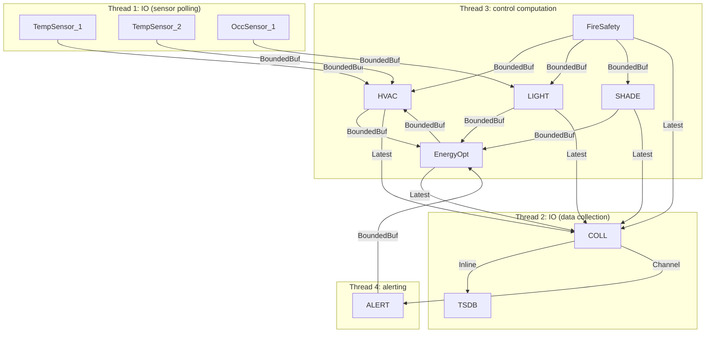

### 2.4 Deployment Mapping (Graph Homomorphism)

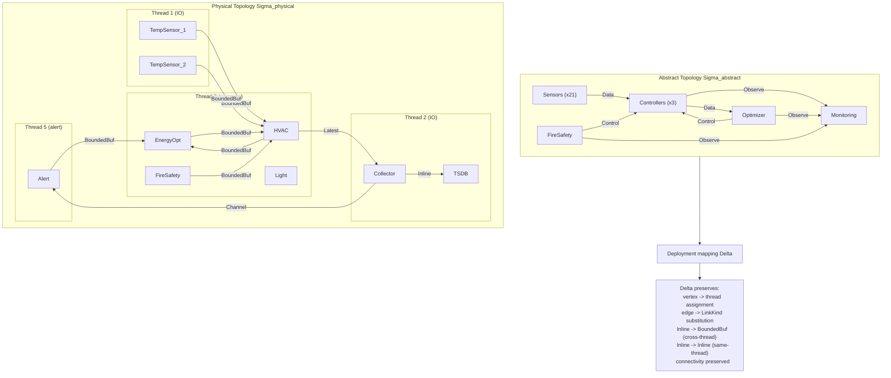

### 2.5 Static Graph Analysis

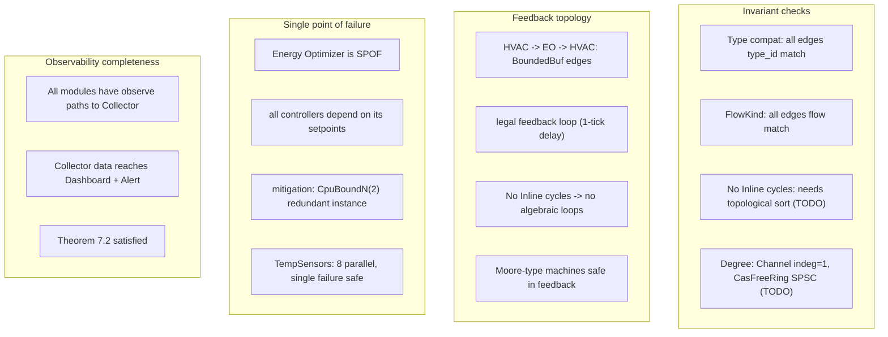

### 2.6 Runtime Lifecycle (5 timesteps)

```mermaid
---
displayMode: compact
---
gantt
  title Building Management System - 5 timesteps
  dateFormat  HH:mm
  axisFormat  %H:%M

  section t=0: Init
  DeploySpec::validate()           :00:00, 1min
  Machine::init() all modules      :00:01, 1min
  Lifecycle: Init -> Running       :00:02, 1min

  section t=1: Normal
  TempSensor 24.5C -> HVAC         :00:03, 1min
  HVAC -> EnergyOpt 24.3C          :00:04, 1min
  EnergyOpt -> HVAC setpoint 22C   :00:05, 1min
  HVAC -> Collector status OK      :00:06, 1min
  Collector -> TSDB write          :00:07, 1min

  section t=2: Optimization
  Electricity price signal         :00:08, 1min
  EnergyOpt new strategy           :00:09, 1min
  Setpoint -> 23.5C (eco)         :00:10, 1min
  Light schedule -> dim(70%)       :00:11, 1min
  Shade strategy -> max solar      :00:12, 1min

  section t=3: Safety Event
  FireSafety smoke alarm           :00:13, 1min
  emergency_stop to all            :00:14, 1min
  HVAC Lifecycle: Running->Stopping:00:15, 1min
  All controllers override         :00:16, 1min

  section t=4: Cleanup
  HVAC::cleanup() close valves     :00:17, 1min
  LIGHT::cleanup() emergency mode  :00:18, 1min
  SHADE::cleanup() open blinds     :00:19, 1min
  Lifecycle: Stopping -> Stopped   :00:20, 1min
  Collector final report to disk   :00:21, 1min
```

---

## Design Summary

| Feature | Demonstrated in this scenario |
|---------|-------------------------------|
| Heterogeneous multi-port | HVAC: 4 input types (temp/setpoint/mode/estop) + 4 output types (valve/fan/aggregate/status) |
| Multi-source fan-in | 8 TempSensors -> HVAC -> EnergyOpt (hierarchical aggregation) |
| Multi-target fan-out | EnergyOpt -> HVAC + LIGHT + SHADE (broadcast setpoints) |
| Control/data co-flow | Setpoint is Control for sender, Data for receiver |
| Observe isolation | All observe ports reach only Collector, not delta computation |
| Safety override | FireSafety emergency_stop overrides all control commands |
| Feedback loop | HVAC -> EnergyOpt -> HVAC (legal: BoundedBuf edges, no algebraic loop) |
| Deployment invariance | Same Machine code, different LinkKinds for testing vs production |
| Type safety | Compiler prevents sending temperature to lighting controller |
| Runtime agnostic | Single-thread for-loop / Tokio / Embassy: zero code change |
