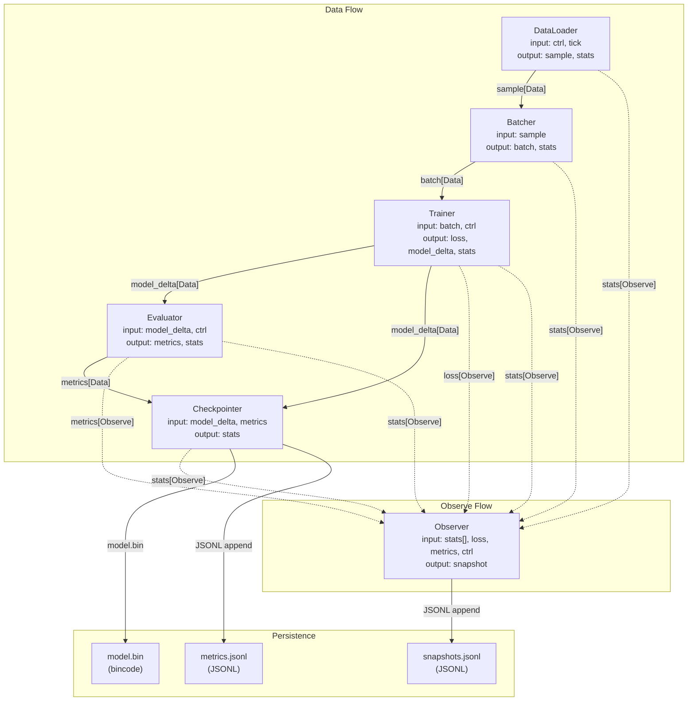
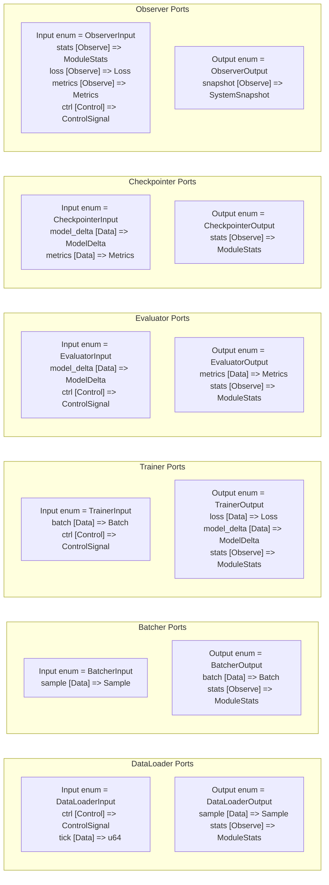
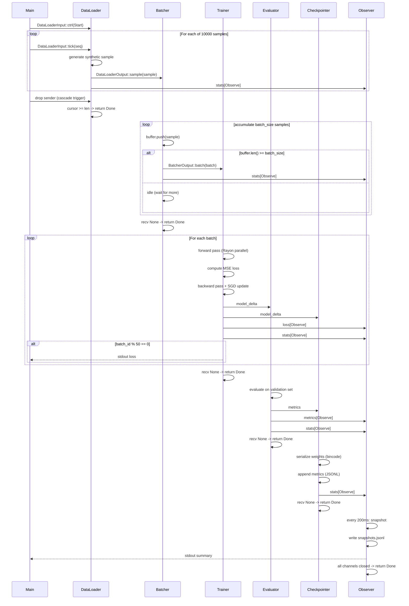
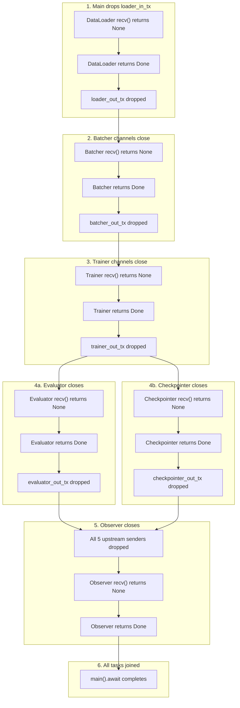
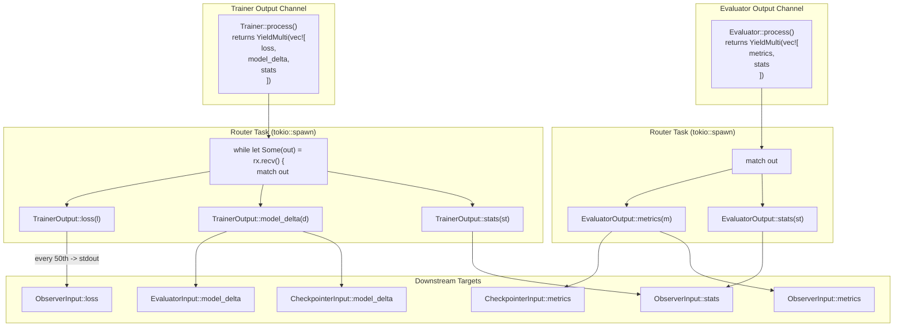
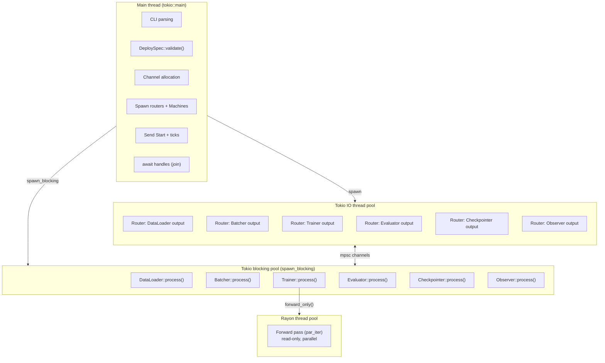
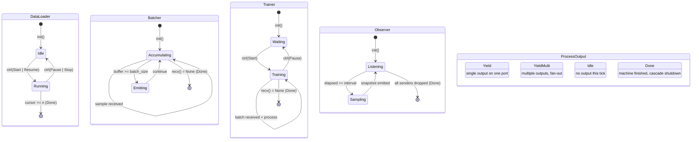
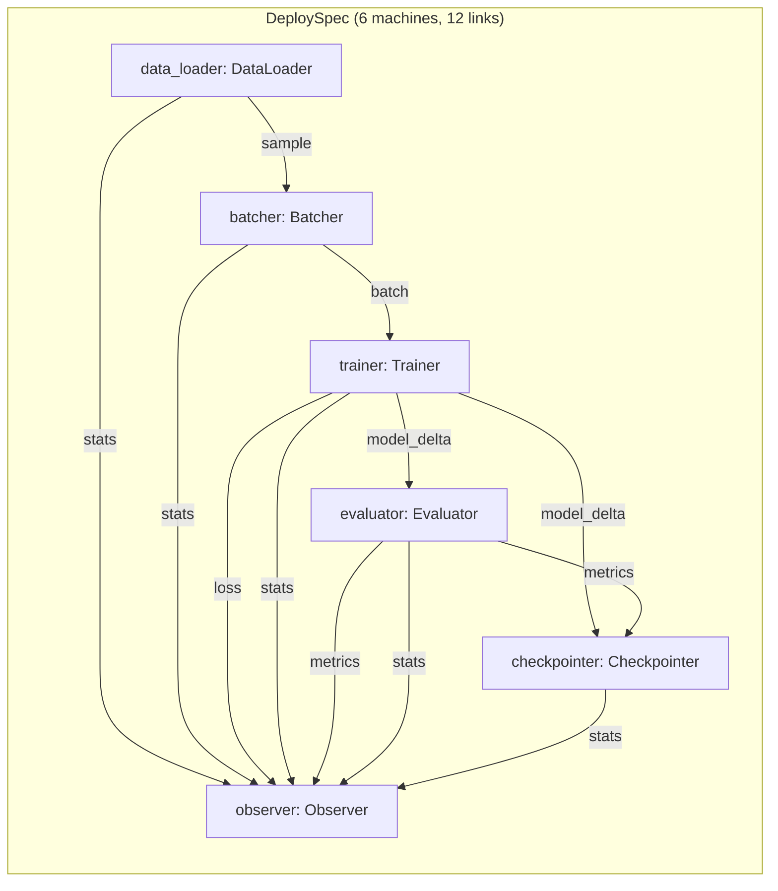

# Training Server — Diagrams

> Mermaid architecture, topology, and lifecycle diagrams for the concurrent neural network training server.
> Render with any Mermaid-compatible viewer.

---

## 1. System Topology Overview



---

## 2. Port Interface Sets (per Machine)



---

## 3. Data Processing Pipeline



---

## 4. Cascade Shutdown Sequence



---

## 5. Output Router Fan-out



---

## 6. Thread Model



---

## 7. Neural Network Data Flow

```mermaid
graph LR
  subgraph Input["Input: batch of 32 samples"]
    I1["features: Vec&lt;Vec&lt;f64&gt;&gt;
    each sample: [x1, x2]
    label: y = sin(x1) + x2^2 + noise"]
  end

  subgraph Forward["Forward pass (Rayon parallel)"]
    L1["Layer 1: Linear(2, 16) + ReLU"]
    L2["Layer 2: Linear(16, 8) + ReLU"]
    L3["Layer 3: Linear(8, 1)  (linear)"]
  end

  subgraph Loss["Loss computation"]
    MSE["MSE = mean(pred - label)^2"]
  end

  subgraph Backward["Backward pass (serial)"]
    B1["dL/dw3 = h2^T * dL/dy"]
    B2["dL/dw2 = h1^T * dL/dh2"]
    B3["dL/dw1 = x^T * dL/dh1"]
  end

  subgraph Update["SGD update"]
    S1["v = momentum * v + lr * grad"]
    S2["w = w - v"]
  end

  subgraph Output["Outputs"]
    O1["Loss { batch_id, loss, epoch }"]
    O2["ModelDelta { epoch, weights }"]
  end

  I1 --> L1
  L1 --> L2
  L2 --> L3
  L3 --> MSE
  MSE --> Backward
  Backward --> Update
  Update --> O1
  Update --> O2

  note right of Forward: "32 samples in parallel
  using rayon::par_iter()
  read-only access to weights"
```

---

## 8. State Machine Transitions



---

## 9. DeploySpec Topology (Graph View)



---


---

## 10. One Complete Training Tick

``mermaid
gantt
  title One complete training run (10000 samples, batch_size=32)
  dateFormat  HH:mm:ss
  axisFormat  %M:%S

  section DataLoader
  init + generate 10000 samples  :a1, 00:00:00, 00:00:02
  send tick * 10000              :a2, 00:00:02, 00:00:05
  Done                            :a3, 00:00:05, 00:00:01

  section Batcher
  recv samples -> emit batches   :b1, 00:00:05, 00:00:20

  section Trainer
  forward (Rayon)                 :c1, 00:00:05, 00:00:10
  backward + SGD                  :c2, 00:00:10, 00:00:15
  emit outputs                    :c3, 00:00:15, 00:00:01

  section Evaluator
  recv model_delta + eval         :d1, 00:00:15, 00:00:05
  emit metrics                    :d2, 00:00:20, 00:00:01

  section Observer
  snapshot every 200ms            :e1, 00:00:05, 00:00:25
``
